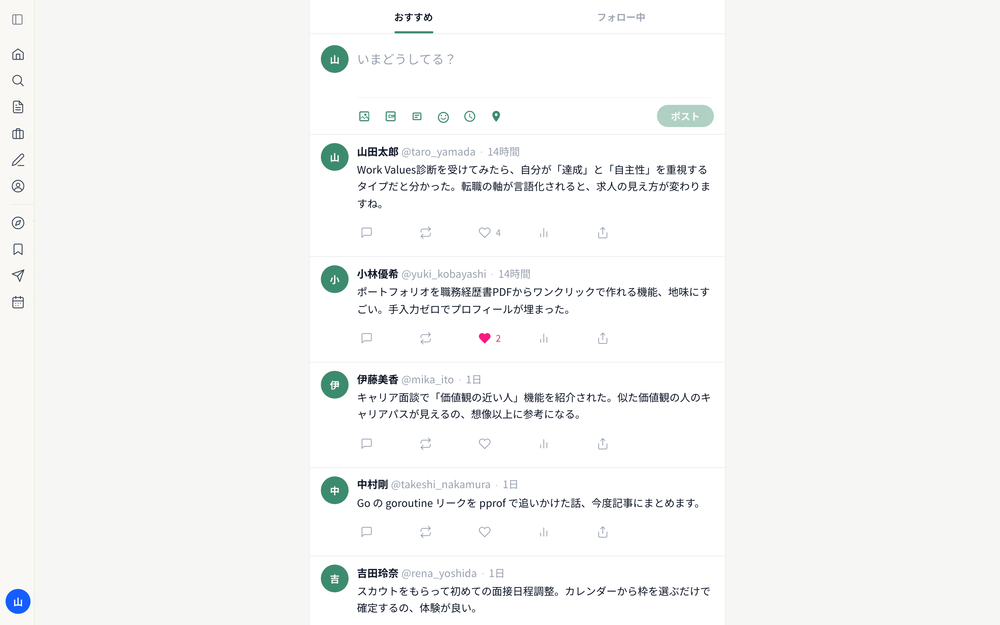
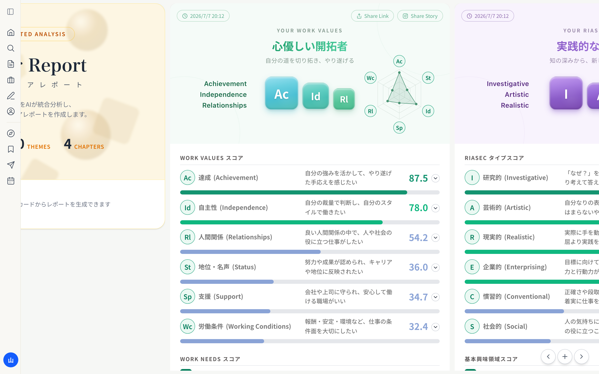
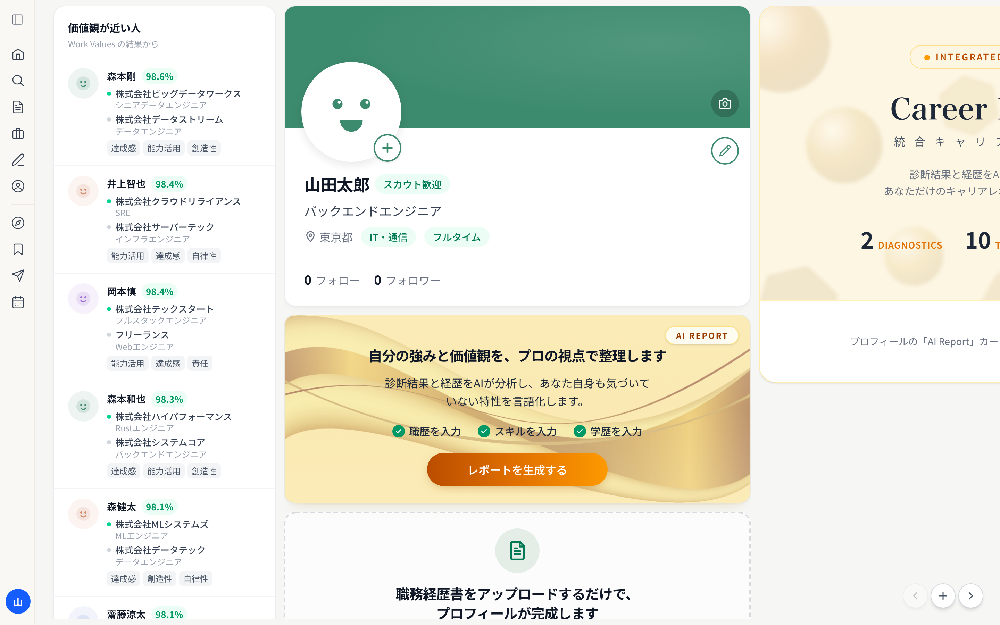
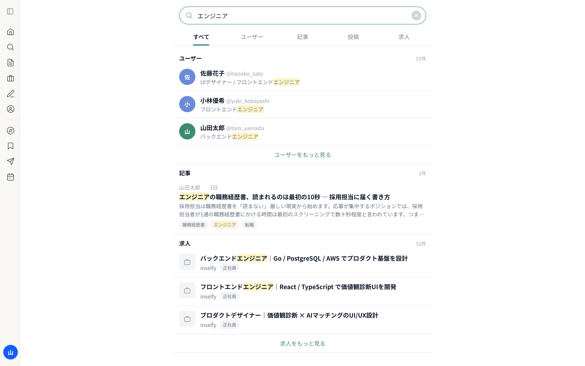
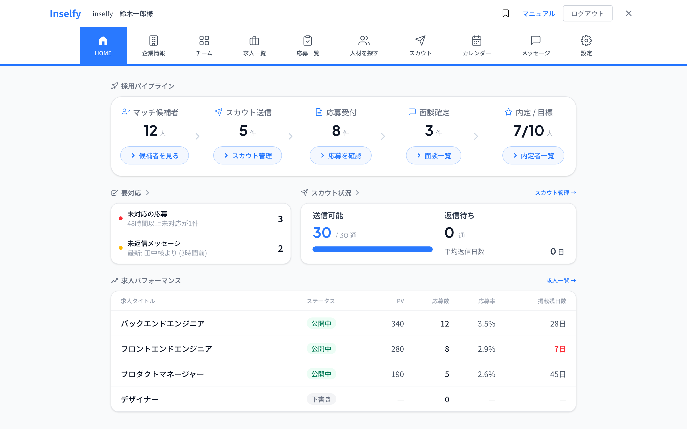
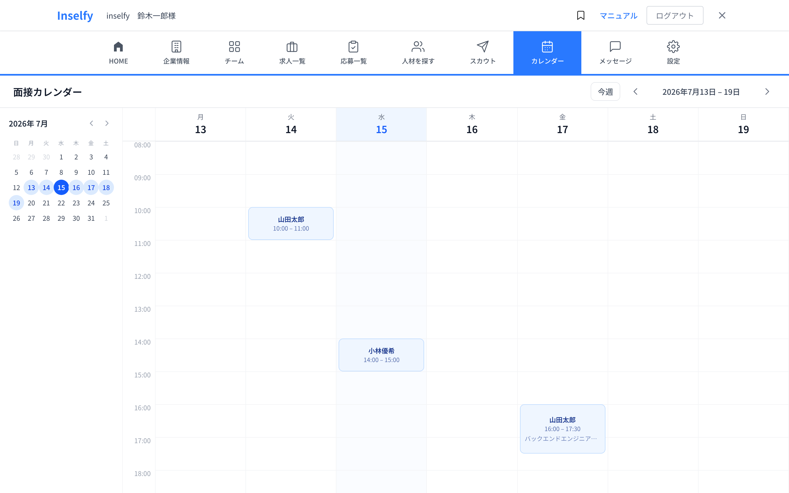
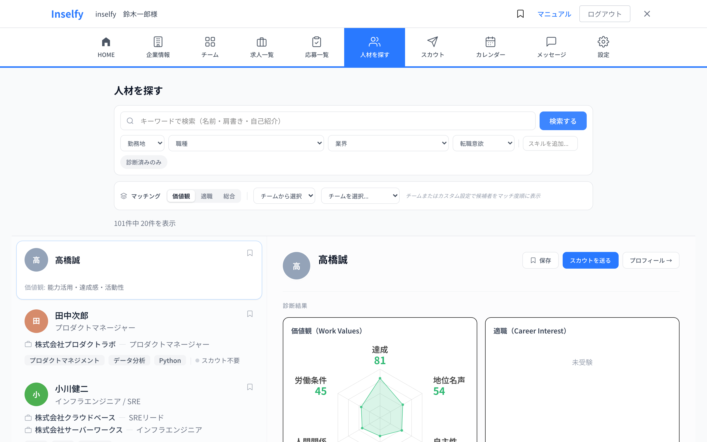
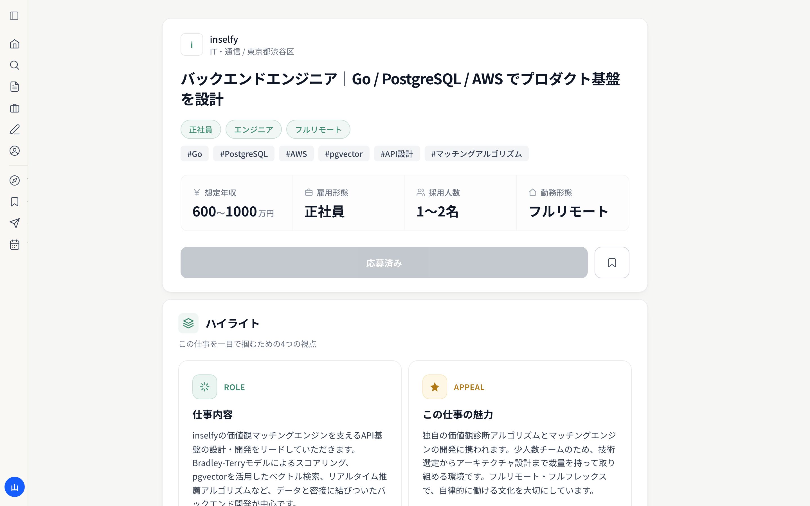
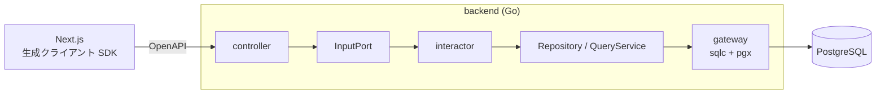

# inselfy

**「価値観」でマッチングするキャリア SNS × HR プラットフォーム**

候補者は SNS 形式でキャリアを発信しながら、学術理論（TWA / RIASEC）に基づく価値観・適職診断を受けられます。企業は診断結果との価値観マッチ度で候補者を探し、スカウト送信から面接日程調整までをこのプラットフォーム上で完結できます。

🔗 **デモ:** https://inselfy-2x4xavv5gq-an.a.run.app

| 候補者フィード | 価値観診断の結果 |
|---|---|
|  |  |

---

## 主要機能

### 候補者向け

| | |
|---|---|
|  |  |
| **プロフィール** — 職務経歴書 PDF をアップロードするだけで職歴・スキル・学歴が自動反映。診断結果から「価値観が近い人」を推薦 | **横断検索「みつける」** — ユーザー・記事・投稿・求人を 1 クエリで federated search。マッチ箇所ハイライト・カテゴリ絞り込み |

- **Work Values 診断** — 21 の Work Needs をアダプティブ一対比較（50〜70 問）で測定し、Bradley-Terry モデルでスコア推定。循環三つ組による整合性チェック付き
- **Career Interest 診断** — RIASEC タイプと基本興味領域を測定
- **AI レポート** — 診断結果と経歴を統合分析したキャリアレポートを生成
- **SNS 機能** — 投稿・記事（有料記事対応）・フォロー・いいね・リポスト・DM

### 企業向け

| | |
|---|---|
|  |  |
| **採用ダッシュボード** — マッチ候補者 → スカウト → 応募 → 面談 → 内定のパイプラインを一望 | **面接カレンダー** — 候補者に日程候補を提案し、選択されると自動確定。週表示でステータス別に色分け |



**人材検索** — 診断結果に基づく価値観マッチ度順で候補者を表示。レーダーチャートで価値観プロファイルを比較し、そのままスカウト送信。

### 求人詳細



管理側では求人票 PDF を Claude が読み取り、構造化されたリッチな求人ページを自動生成するワークフローも整備しています。

---

## 技術スタック

| 領域 | 技術 |
|---|---|
| フロントエンド | Next.js 16 (App Router) / React 19 / TypeScript / Tailwind CSS 4 / Biome |
| バックエンド | Go（クリーンアーキテクチャ） |
| データベース | PostgreSQL 16 + pgvector |
| API スキーマ | TypeSpec → OpenAPI → 型付きクライアント自動生成（schema-first） |
| コード生成 | sqlc / oapi-codegen / goverter |
| インフラ | GCP Cloud Run + Neon + Cloudflare R2、Terraform で IaC 管理 |
| CI/CD | GitHub Actions（テスト・lint・E2E・ドリフト検査・自動デプロイ・ロールバック） |

## アーキテクチャ



依存方向は **domain ← port ← usecase ← adapter/driver** の一方向のみ。この境界は `.golangci.yml` の depguard で**機械的に強制**しており、レビューではなく lint で違反を検出します。

### 技術的な意思決定

- **schema-first な API 契約** — TypeSpec を唯一の情報源とし、OpenAPI 経由でバックエンドのハンドラ型とフロントエンドの型付き SDK を両方生成。生成物のドリフトは pre-push フックと CI の二段で検査し、契約と実装の乖離を構造的に防止
- **手書き写経の排除** — SQL は sqlc、API 境界は oapi-codegen、層をまたぐ struct 変換は goverter でコード生成。「別モデルは保ちつつマッパーだけ生成する」線引きルールを明文化
- **Terraform と deploy.yml の管轄分離** — 土台（サービス・IAM・Secret の入れ物・予算アラート）は Terraform、リリース（イメージ・env・probe・トラフィック）は deploy.yml と役割を固定し、ドリフトを防止
- **ランニングコストの設計** — アプリは Cloud Run の従量課金、DB は Neon、画像ストレージは Cloudflare R2 という構成で月数百円規模に抑制。GCP・Cloudflare それぞれに予算アラートを設定し、支出の異常に気づける状態を維持

---

## UI/UX

画面や機能を作るときは、実際に画面を触りながら「どうすれば迷わず使えるか」を試行錯誤して作りました。実装前に NNGroup の UX リサーチや国内 HR テック（SmartHR・カオナビ等）のデザインを調べてから画面を設計しています。認知負荷・空状態・カードとテーブルの使い分けなど、検討した設計原則は設計資料として記録しています。

---

## CI/CD

個人開発で自分しかいないからこそ、人間の注意力に頼らずリリースできる仕組みを整えました。GitHub Actions のワークフローは 11 本、main へのマージからデプロイまで人手を挟みません。

```
push to main
  │
  ├─ CI ゲート（並列・全部緑でないと先に進めない）
  │    backend CI / frontend CI / migrations CI / E2E スモーク
  │
  └─ deploy
       1. OIDC(WIF) で GCP 認証 — 長期クレデンシャルは一切保持しない
       2. docker build → Artifact Registry（イメージタグ = git SHA）
       3. 本番 DB へ migrate up（expand-contract 縛り）
       4. Cloud Run に「トラフィック 0%」で新リビジョン作成
       5. candidate URL で /api/readyz を検証 ← 失敗しても本番は無傷
       6. 検証を通って初めてトラフィック切替 → 本番 URL で最終スモーク
```

- **本番を壊さずに失敗できる** — 新リビジョンはまずトラフィック 0% で起動し、専用 URL でヘルスチェックに合格してから切り替える。ビルドが通っても起動しないコード（env 不足・migration 齟齬など）が本番に到達する前に止まる
- **ロールバックは 1 クリック・数十秒** — rollback.yml を実行するだけで 1 つ前の Ready リビジョンに自動で戻る（イメージ再ビルド不要）。GitHub Actions 自体が落ちている場合の gcloud 直叩き手順まで runbook 化
- **ロールバックしても DB が壊れない** — マイグレーションは expand-contract を規約化。カラム削除や NOT NULL 化などの破壊的変更は「参照を消したリリースの次のリリース」でのみ行うため、旧リビジョンに戻しても新スキーマで動く
- **「本番で動いているのはどのコード？」に即答できる** — イメージタグ = git SHA 12 桁。Cloud Run リビジョン → イメージ → コミットが一意に辿れる
- **契約の乖離は push 前に手元で捕まえる** — TypeSpec からの生成物（OpenAPI・Go ハンドラ・TS クライアント・sqlc）のドリフト検査は、生成元を触った push のときだけ pre-push フックで実行（触っていなければ 0 秒）。CI の同じ検査は最後の保険。golangci-lint による層境界（depguard）検査、依存の security スキャン、Terraform の plan 検査、tagpr によるリリース PR 自動生成も PR の段階で機械的に検出
- **E2E は「本番と同じもの」を試す** — テスト専用構成ではなく、本番と同一の Dockerfile（Next.js + Go API 同居の単一イメージ）を docker compose で結合起動し、migrate → 起動 → 主要フローを検証。Cloud Run の probe が通る経路（front の catch-all proxy 経由）まで常時テストされる

### 品質への取り組み

- バックエンド: golangci-lint を強化設定で運用、`make check`（build + lint + test）を必須化
- フロントエンド: Biome recommended フル有効・error ゼロ運用（例外は理由付き `biome-ignore` のみ）

---

## 開発環境

<details>
<summary>セットアップ手順</summary>

前提: Docker / Go / Node.js

```bash
cp .env.example .env        # 環境変数
npm install                 # git hooks（lefthook）
docker compose up -d db     # PostgreSQL
cd backend
make migrate-up             # マイグレーション
make run                    # API (localhost:8081)
cd ../frontend
npm install && npm run dev  # フロント (localhost:3000)
```

oapi-codegen / sqlc は `backend/` で `make install-codegen-tools` を実行して導入する（goverter は `go.mod` の `tool` ディレクティブ管理のためインストール不要）。

### 主要コマンド

```bash
# backend/
make check     # build + lint + test（変更したら必ず通す）
make oapi      # OpenAPI からハンドラ/モデル生成
make sqlc      # SQL からリポジトリコード生成
make goverter  # struct マッパー生成

# frontend/
npm run lint && npm run typecheck && npm run test

# api-schema/
npm run generate   # TypeSpec → OpenAPI → TS クライアント

# E2E スモーク（front: 18080 / API: 18081）
docker compose --profile e2e up -d --build
docker compose --profile e2e down   # ※ -v は開発 DB が消えるため付けない
```

### マイグレーション運用

- dirty 状態の修復は `make migrate-force`（適用済みバージョン指定）→ `make migrate-up`。`down -all` → `up` は全データが消えるため禁止
- 本番は expand-contract 縛り

</details>

## ディレクトリ構成

```
frontend/     Next.js アプリ
backend/      Go API（domain / port / usecase / adapter / driver）
api-schema/   TypeSpec スキーマと生成パイプライン
infra/        Terraform（GCP standing infrastructure）
prompts/      AI レポート生成用プロンプトテンプレート
```
